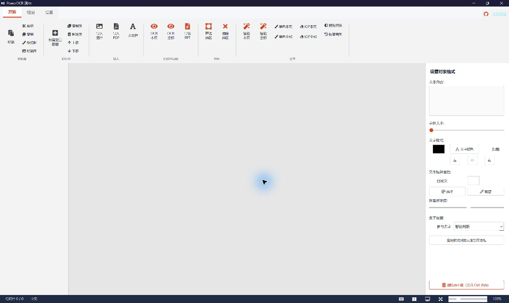
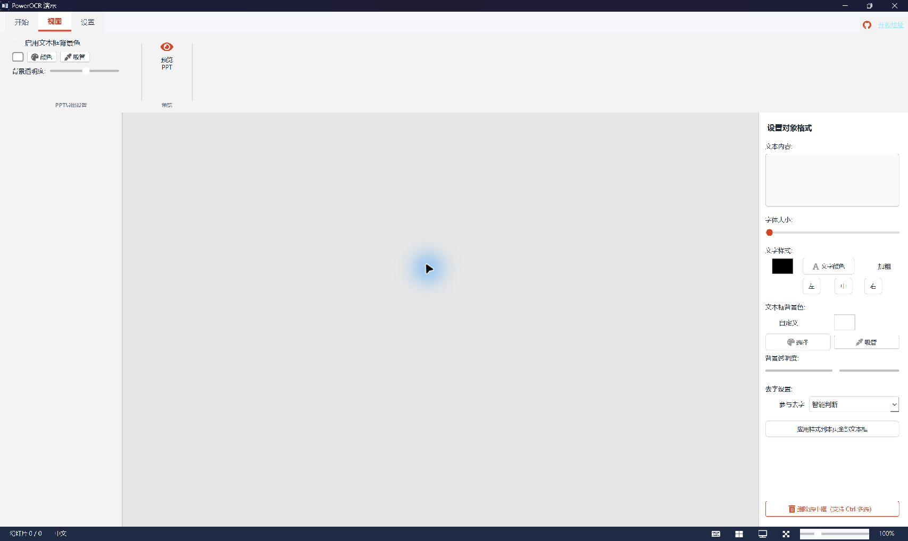
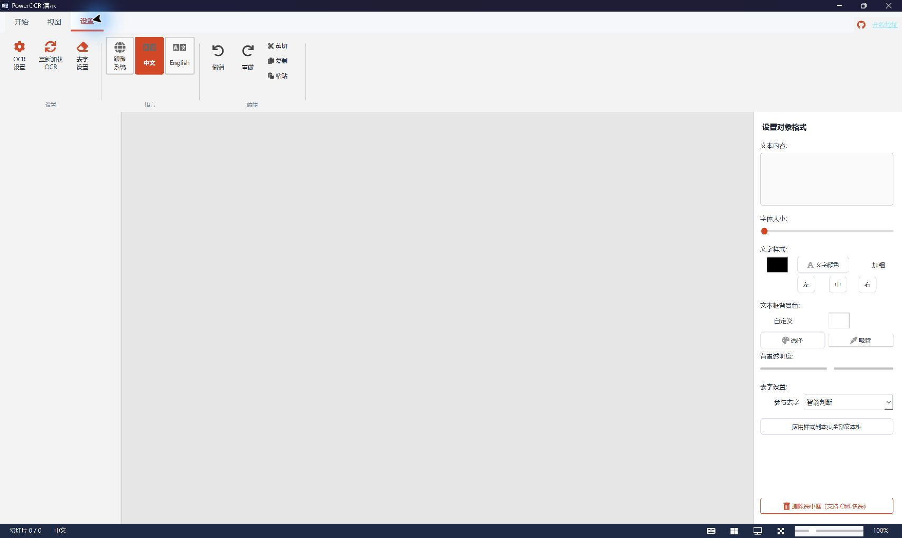

[中文](README.zh-CN.md) | English

# OCRPDF-TO-PPT (PowerOCR Presentation)

OCRPDF-TO-PPT is a Windows desktop application that turns images and PDF pages into editable PowerPoint files (`.pptx`) with OCR. The original image, or a cleaned copy with source text removed, becomes the slide background. Recognized text is exported as movable, editable PowerPoint text boxes.

Daily use does not require a console. After installing the dependencies, double-click **`一键启动 OCRPDF-TO-PPT.bat`** in the project root.



## Highlights

- Ribbon interface organized into Home, View, and Settings tabs.
- Multi-page workflow with image/PDF import, blank slides, duplication, ordering, and thumbnail navigation.
- OCR for the current page or all pages, with an optional ROI for targeted processing.
- Editable boxes with move, resize, text editing, font size, color, bold, alignment, background color, and opacity controls.
- **Multi-select deletion:** hold `Ctrl` and click boxes to add or remove them from the selection, then press `Delete` to remove every selected box at once.
- Three cleaning modes: Smart Clean, Solid Fill, and IOPaint, each available for the current page or all pages.
- Editable PPTX output that remains easy to refine in PowerPoint.
- One-click launcher that uses the project environment and opens the GUI without a console window.

## Current interface

The View tab contains text-background, color-picking, opacity, and PowerPoint preview controls. The Settings tab contains OCR, cleaning, language, and editing controls.

<p>
  
  
</p>

### Home

- Clipboard: paste text boxes or images.
- Slides: new blank slide, duplicate, delete, move up, and move down.
- Import: images, PDFs, and text boxes.
- OCR: current page or all pages.
- Export: create a PPTX file.
- ROI: select or clear a processing region.
- Cleaning: Smart Clean, Solid Fill, IOPaint, preview, and restore original.

### View

- Enable or disable text-box backgrounds in the exported presentation.
- Set a global background color, pick a color from the image, and adjust background opacity.
- Preview the PowerPoint result.

### Settings

- Open OCR Settings and Clean Settings, or reload the OCR engine.
- Switch between Auto/System, Chinese, and English.
- Access undo, redo, cut, copy, and paste.

## Requirements

- 64-bit Windows 10 or 11.
- Python 3.13; the bundled Windows setup and launch scripts check this version.
- An internet connection for first-time dependency installation and OCR model downloads.
- Several GB of free disk space is recommended for the Python environment and OCR models.

PaddlePaddle support depends on the Python, CUDA, and driver combination. CPU mode works by default. For GPU acceleration, install the PaddlePaddle build that matches the local CUDA environment.

## Quick start (recommended)

### 1. Get the project

```powershell
git clone https://github.com/frp769/OCRPDF-TO-PPT.git
cd OCRPDF-TO-PPT
```

You can also download and extract the repository ZIP.

### 2. Start the application

Double-click `一键启动 OCRPDF-TO-PPT.bat`.

The launcher first checks the project-local `.venv-launcher`. On a new device, in a freshly extracted directory, or after dependency damage, it automatically finds Python 3.13 and creates or repairs the environment from `requirements.txt`. It then opens the GUI with that environment's `pythonw.exe`. You therefore **do not need to run `python main.py` in a console**.

If automatic setup fails, double-click `安装或修复依赖.bat` to see the complete installation output. Typical causes are a missing Python 3.13 installation, unavailable dependency downloads, or insufficient disk space.

PaddleOCR/PaddleX may download models the first time OCR is used. Models remain in the local cache and are not uploaded to GitHub.

### How cross-device startup works

- The BAT and PowerShell scripts derive the project root from their own location. They do not depend on the original drive, Windows user name, or an absolute checkout path, and paths containing spaces or Chinese characters are supported.
- `.venv-launcher` is always created inside the current project. Startup explicitly sets `VIRTUAL_ENV` and disables user-level Python packages.
- The setup script can find Python 3.13 through the Python Launcher, per-user and system-wide install locations, or `PATH`.
- The virtual environment is not uploaded to GitHub and should not be copied from another computer. Each device rebuilds it locally from the same `requirements.txt`, avoiding stale paths and incompatible binaries.

## Workflow

### 1. Import images or a PDF

- Click Import Image or press `Ctrl+O`.
- Click Import PDF or press `Ctrl+Shift+O`.
- PDF pages are rendered as images and added to the thumbnail list on the left.
- You can also create blank slides, duplicate the current slide, delete slides, and change their order.

### 2. Run OCR

- OCR Current recognizes only the active page (`Ctrl+Enter`).
- OCR All processes every page (`Ctrl+R`).
- To process only part of a page, draw an ROI first; clear it when you want to return to the full-page range.

### 3. Edit recognized content

- Click a text box to select it, drag it to move it, or drag its handles to resize it.
- Double-click a text box to edit its text.
- Use the right properties panel to change text, size, color, bold, alignment, background, and opacity.
- Each box can opt in or out of cleaning and can use its own cleaning mode.
- Apply Style to All Boxes on Slide quickly makes the current page consistent.
- `Ctrl+C / Ctrl+X / Ctrl+V` copy, cut, and paste text boxes.
- With no box selected, `Ctrl+V` can paste a clipboard image; `Ctrl+Shift+V` pastes an image directly.

#### Multi-select and batch delete

1. Hold `Ctrl` and click each box you want to add to or remove from the selection.
2. All selected boxes stay selected.
3. Press `Delete`, or use Delete Selected Boxes in the right panel, to remove the entire selection at once.
4. Press `Ctrl+Z` if you need to undo the deletion.

### 4. Remove source text from the background

Cleaning reduces the double-text effect caused by original text remaining in the image underneath the new OCR boxes.

- **Smart Clean:** prefers solid fill for simple backgrounds and automatically uses IOPaint for complex textures or explicitly configured boxes.
- **Solid Fill:** fills text regions with a sampled background color; it works best on white or uniform backgrounds.
- **IOPaint:** always calls the optional local IOPaint API and is useful for photos or textured backgrounds.

Each mode can process the current page or every page. Clean Preview toggles between the source and cleaned background, while Restore Original clears the current page's cleaned result.

To use IOPaint, start a local service such as:

```powershell
iopaint start --host 127.0.0.1 --port 8080
```

Then enable it under Settings → Clean Settings. The safe example endpoint is `http://127.0.0.1:8080/api/v1/inpaint`.

### 5. Preview and export

- Press `F5` or click Preview PPT.
- Press `Ctrl+S` or click Export PPT to save a `.pptx` file.
- A cleaned page background is preferred when one is available.
- OCR text is exported as independent PowerPoint text boxes and remains editable.

## Keyboard shortcuts

Press `F1` in the application to open the complete shortcut reference.

| Action | Shortcut |
| --- | --- |
| Import image / PDF | `Ctrl+O` / `Ctrl+Shift+O` |
| OCR current / all | `Ctrl+Enter` / `Ctrl+R` |
| Smart Clean current / all | `Ctrl+I` / `Ctrl+Shift+I` |
| Export / preview PPT | `Ctrl+S` / `F5` |
| New / duplicate slide | `Ctrl+N` / `Ctrl+D` |
| Move slide up / down | `Alt+Up` / `Alt+Down` |
| Previous / next slide | `PageUp` / `PageDown` |
| Add or remove a box from selection | `Ctrl+Click` |
| Delete all selected boxes | `Delete` |
| Undo / redo | `Ctrl+Z` / `Ctrl+Y` |
| Paste image | `Ctrl+Shift+V` |
| Fit to window | `Ctrl+0` |
| Zoom in / out | `Ctrl++` / `Ctrl+-` |
| Toggle thumbnails | `Ctrl+Alt+L` |
| Toggle properties panel | `Ctrl+Alt+R` |
| Shortcut help | `F1` |

The canvas also supports `Ctrl+Wheel` for zoom and middle-button dragging for panning.

## Advanced: manual console launch

The one-click launcher covers normal use. For development or troubleshooting only, you can create a separate environment and launch manually:

```powershell
py -3.13 -m venv .venv
.\.venv\Scripts\python.exe -m pip install -U pip
.\.venv\Scripts\python.exe -m pip install -r requirements.txt
.\.venv\Scripts\python.exe main.py
```

This manual `.venv` is separate from the launcher's `.venv-launcher` environment.

## Configuration and privacy

- Runtime configuration is stored locally in `settings.json`.
- Because it may contain local paths or private service endpoints, `settings.json` is excluded by `.gitignore`.
- Copy `settings.example.json` when you need a safe template; it contains localhost endpoints only.
- Virtual environments, logs, model caches, AI/cleaning caches, generated PDF/PPT files, and archives are excluded from Git.
- Review your own screenshots, sample documents, and new configuration before publishing changes.

## Troubleshooting

### Double-clicking the launcher does not open a window

1. Inspect `logs/launcher.log`.
2. Run `安装或修复依赖.bat` again.
3. Confirm that `py -3.13` works.
4. If security software blocked the scripts, allow the project's BAT, PowerShell, and `pythonw.exe` processes.

### The first OCR run is slow

The first run may download and initialize OCR models. Keep the network available and make sure the model cache directory is writable.

### PDF import fails

Run the dependency repair script and confirm that PyMuPDF was installed successfully.

### GPU mode is unavailable

The application attempts to fall back to CPU. If GPU mode is required, verify that the PaddlePaddle GPU wheel, CUDA, and graphics driver versions match.

### IOPaint cleaning fails

Make sure the local IOPaint service is running and check the endpoint under Settings → Clean Settings. Smart Clean and Solid Fill do not require IOPaint for simple solid-color regions.

## Project structure

```text
OCRPDF-TO-PPT/
├─ 一键启动 OCRPDF-TO-PPT.bat   # Daily launch entry point
├─ 安装或修复依赖.bat           # First-time setup and repair
├─ scripts/
│  ├─ start.ps1                 # Auto-repair, preflight, and console-free launch
│  ├─ setup.ps1                 # Python 3.13 environment setup
│  └─ preflight.py              # Dependency validation
├─ launcher.pyw                 # Windows GUI launcher
├─ main.py                      # Ribbon UI and main workflow
├─ ocr_engine.py                # PaddleOCR 2.x/3.x compatibility
├─ ppt_export.py                # Editable PPTX export
├─ settings.example.json        # Safe local configuration example
├─ docs/images/                 # Current interface screenshots
└─ tests/                       # Core automated tests
```

## Development validation

After installing dependencies:

```powershell
.\.venv-launcher\Scripts\python.exe scripts\preflight.py
.\.venv-launcher\Scripts\python.exe -m unittest discover -s tests -v
```

## Source and license status

This project is based on [Tansuo2021/OCRPDF-TO-PPT](https://github.com/Tansuo2021/OCRPDF-TO-PPT). See [NOTICE.md](NOTICE.md) for attribution and license status.

The upstream repository did not include an explicit license when this private repository was prepared. Keep this repository private, and do not redistribute the code until permission or license terms are confirmed.

## Acknowledgements

- PaddleOCR / PaddlePaddle
- PySide6 (Qt)
- python-pptx
- PyMuPDF
- IOPaint (optional cleaning backend)
- QtAwesome
